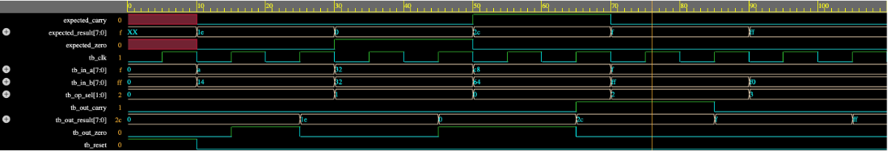

# 8-Bit Pipelined ALU in Verilog

## Overview
This project implements an 8-bit Arithmetic Logic Unit (ALU) using Verilog HDL. The design emphasizes **pipeline synchronization** and hardware-safe combinational logic to prevent timing hazards.

The design supports:
- Addition
- Subtraction (Two's complement)
- Bitwise AND
- Bitwise OR

## Architecture & Module Structure
The system features a **2-cycle pipeline latency** with fully registered inputs and outputs. 
The top-level, ALU_System, integrates several distinct sub-modules to achieve this synchronization:
- **Input Registers:** 8-bit registers for incoming data (A and B), and a 2-bit register to capture the operation selector (op_sel).
- **Core Logic:** The ALU_Core, a purely combinational block that handles the mathematical routing.
- **Output Registers:** An 8-bit register for the final computed result, alongside dedicated 1-bit registers to synchronize the Zero and Carry flags with the data output.

## Verification
The design was verified using Icarus Verilog with a self-checking testbench. 

The testbench successfully verifies:
- Arithmetic and logical operations
- Zero and Carry flag synchronization
- Reset behavior
- Pipeline timing and cycle-accurate updates
- Edge cases (e.g., arithmetic overflow)

## Simulation Results
The following EPWave simulation demonstrates the pipeline latency. Notice how the output data and status flags update simultaneously on the correct clock edge:

## Tools
- **Languages:** Verilog HDL
- **Simulation:** Icarus Verilog, EPWave
- **Version Control:** Git / GitHub

## About the Developer
Created by Tal Wirt, a third-year Electrical Engineering and Computer Science undergraduate student at The Hebrew University of Jerusalem.
